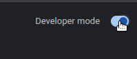
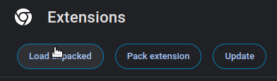
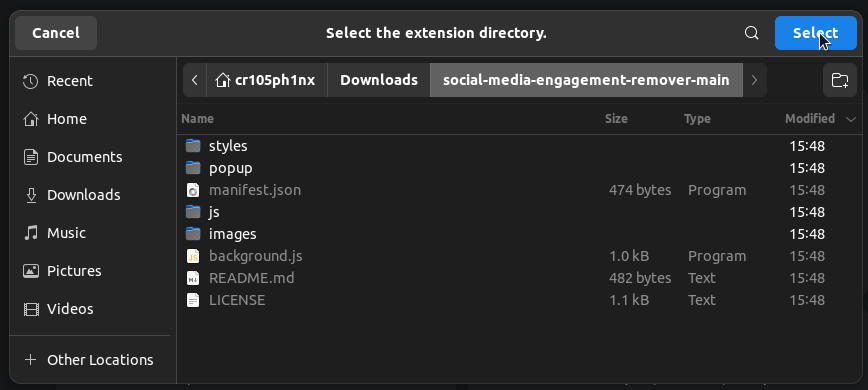

# Social Media Engagement Remover

A Chrome extension to remove all social media engagement. Only TikTok engagement removal is available for now. Please be patient as we add support for more social media apps.

## Installation

To install this extension, kindly follow these steps:

### For Developers
1. Clone this repository
2. In your chromium-based browser, go to `chrome://extensions`
3. Enable `Developer Mode`
4. Click the `Load Unpacked` button and select the extension folder

### For Non-Developers
1. [Download the source code](https://github.com/cr105ph1nx/social-media-engagement-remover/archive/refs/heads/main.zip)
2. Extract the downloaded zip file
3. In your Chrome browser, navigate to [the extensions management page](chrome://extensions)
4. Enable the `Developer Mode` switch on the top right corner of the page

5. Click the `Load Unpacked` button

6. Select the extension folder

7. You will find the extension added to your list of extensions. Enjoy !
